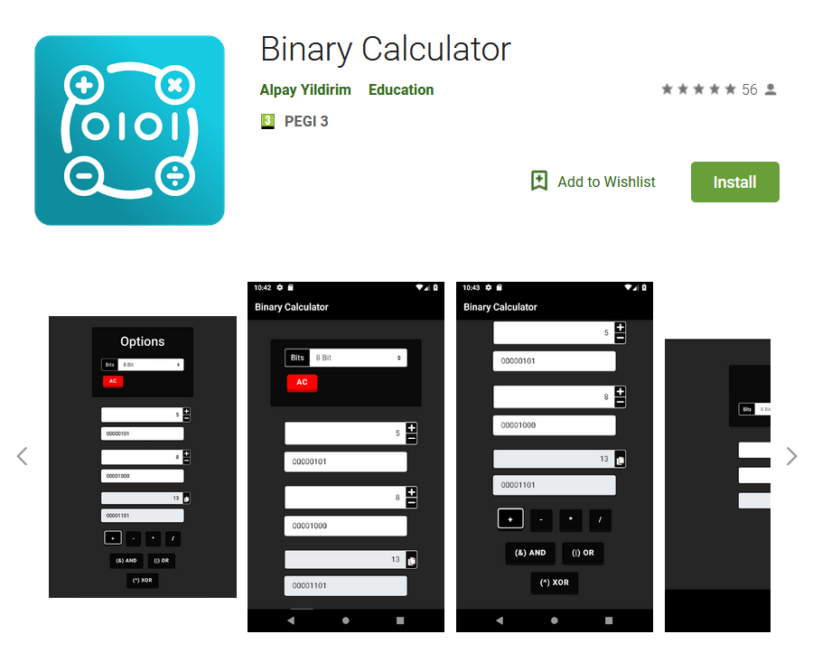
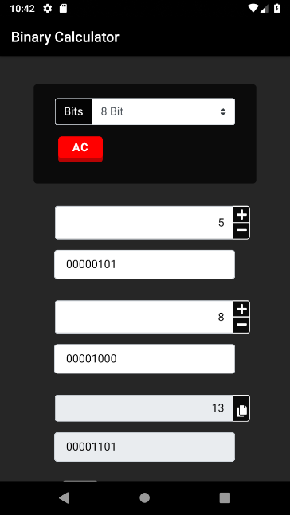
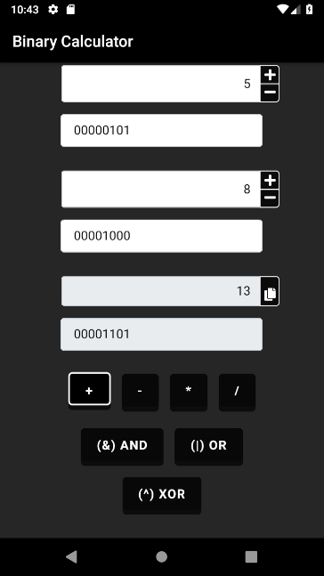

# 📱 [Binary Calculator Android Java App](https://play.google.com/store/apps/details?id=com.binarycalculator.ayidouble.binarycalculator.app) 📱

<h1 align=center>

</h1>

A Completely **Free** handy Calculator for binary operations 📱

**Official Google Play Store Download Link** : **[https://play.google.com/store/apps/details?id=com.binarycalculator.ayidouble.binarycalculator.app](https://play.google.com/store/apps/details?id=com.binarycalculator.ayidouble.binarycalculator.app)**

A handy **Calculator** for binary operations, that works on **all devices**. 📱 💻 🖥

Feel free to use the **Calculator** for teaching Numeral systems as an example.
If you have Suggestions or find Errors, you're free to contact me on GitHub or submit your changes.
The Reason why I build this **Calculator** was, because there wasn't a good one on the Web.

## [📱 FREE Download Google Play Store: 📱](https://play.google.com/store/apps/details?id=com.binarycalculator.ayidouble.binarycalculator.app)

## [📱 Mobile (Smartphone): 📱](https://ayidouble.github.io/Binary-Calculator-JavaScript)

## [💻 Desktop: 🖥](https://ayidouble.github.io/Binary-Calculator-JavaScript)

**[The Binary Calculator is just a Website](https://ayidouble.github.io/Binary-Calculator-JavaScript)** that each possible device can access to. 
## ***You can use the Binary Calculator on your: 📱 💻 🖥***
- ***[Smartphone](https://ayidouble.github.io/Binary-Calculator-JavaScript) (Android/iOS etc.) 📱***
- ***[Tablet](https://ayidouble.github.io/Binary-Calculator-JavaScript) (Chrome, Firefox, Edge, Safari) 📱***
- ***[Laptop](https://ayidouble.github.io/Binary-Calculator-JavaScript) (Chrome, Firefox, Edge, Safari) 💻***
- ***[Desktop](https://ayidouble.github.io/Binary-Calculator-JavaScript) (Chrome, Firefox, Edge, Safari) 🖥***

## Binary Operations ➕ ➖ ➗ ✖️

- **\+ (Addition)**
- **\- (Subtraction)**
- **\* (Multiplication)**
- **\/ (Division)**

- **! (NOT)** ex. ! 10101010 = 01010101
- **<< (Bitwise Left Shift)** ex. 1010 << 0101
- **\>\> (Bitwise Right Shift)** ex. 1010 >> 0101

- **AND / NAND**
- **OR / NOR**
- **XOR / XNOR**

## As efficient as possible ⚙️

The **Calculator** is designed to give responses on every action,
this is noticeable as an example at the addition of two Bytes,
while you're typing, an algorithm already calculates every number you type and displays the result.

## The Calculator allows you to ⛓

- see how Hexadecimal Values are stored in Binary (ex. HTML Color Codes RGB(**255**, **255**, **255**) = RGB(**8-Bit**, **8-Bit**, **8-Bit**))
- how much **8, 16, 32 Bit** can store, (ex. unsigned **8-Bit** can store values from **(00000000) 0 ... 255 (11111111)**)
- see how other numeral systems are working (**ternary**, **quaternary**, **octal**, **hexadecimal**)
